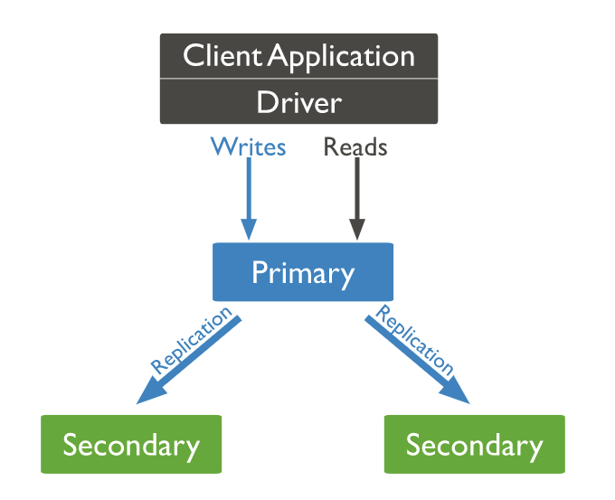
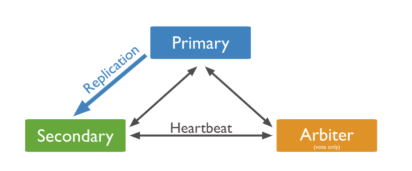
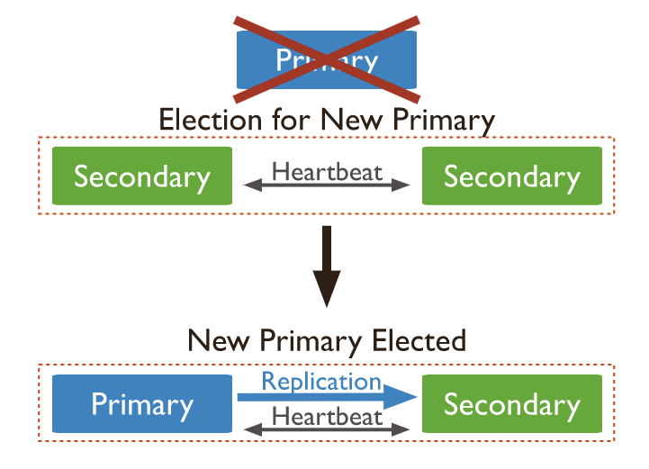
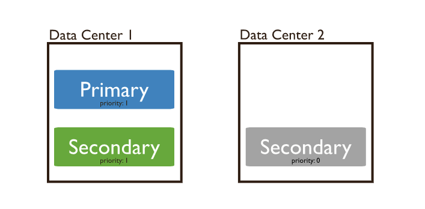
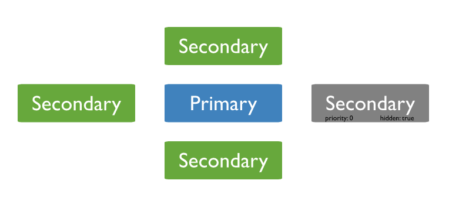
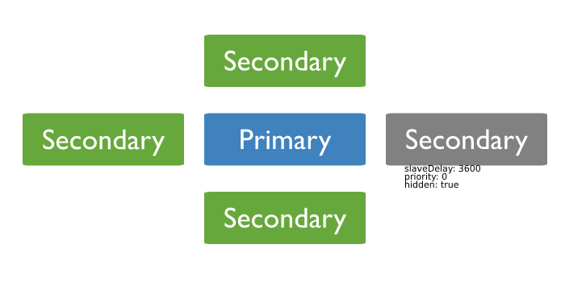
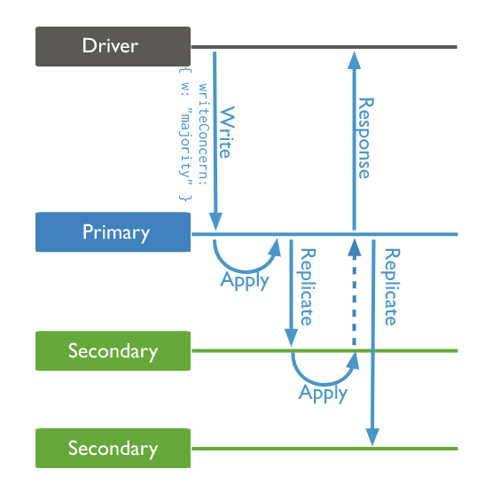

# MongoDB 副本集介绍

MongoDB 副本集（Replica Set）包括主节点（primary）跟副本节点（Secondaries）。

主节点只能有一个，所有的写操作请求都在主节点上面处理。副本节点可以有多个，通过同步主节点的操作日志（oplog）来备份主节点数据。

在主节点挂掉后，有选举权限的副本节点会自动发起选举，并从中选举出新的主节点。

副本节点可以通过配置指定其具体的属性，比如选举、隐藏、延迟同步等，最多可以有 50 个副本节点，但只能有 7 个副本节点能参与选举。虽然副本节点不能处理写操作，但可以处理读请求。

搭建一个副本集集群最少需要三个节点：一个主节点，两个备份节点，如果三个节点分布合理，基本可以保证线上数据 99.9%安全。

三个节点的架构如下图所示：



如果只有一个主节点，一个副本节点，且没有资源拿来当第二个副本节点，那就可以起一个仲裁者节点（arbiter），不存数据，只用来选举用，如下图所示：



当主节点挂掉后，那么两个副本节点会进行选举，从中选举出一个新的主节点，流程如下：


## 副本集属性

对于副本集成员属性，特别需要说明下这几个：priority、hidden、slaveDelay、tags、votes。

### priority

对于副本节点，可以通过该属性来增大或者减小该节点被选举成为主节点的可能性，取值范围为 0-1000（如果是 arbiters，则取值只有 0 或者 1），数据越大，成为主节点的可能性越大，如果被配置为 0，那么他就不能被选举成为主节点，而且也不能主动发起选举。

这种特性一般会被用在有多个数据中心的情况下，比如一个主数据中心，一个备份数据中心，主数据中心速度会更快，如果主节点挂掉，我们肯定希望新主节点也在主数据中心产生，那么我们就可以设置在备份数据中心的副本节点优先级为 0，如下图所示：



### hidden

隐藏节点会从主节点同步数据，但对客户端不可见，在 mongo shell 执行 db.isMaster() 方法也不会展示该节点，隐藏节点必须 Priority 为 0，即不可以被选举成为主节点。但是如果有配置选举权限的话，可以参与选举。

因为隐藏节点对客户端不可见，所以跟客户端不会互相影响，可以用来备份数据或者跑一些后端定时任务之类的操作，具体如下图，4 个备份节点都从主节点同步数据，其中 1 个为隐藏节点：



### slaveDelay

延迟同步即延迟从主节点同步数据，比如延迟时间配置的 1 小时，现在时间是 09:52，那么延迟节点中只同步到主节点 08:52 之前的数据。另外需要注意延迟节点必须是隐藏节点，且 Priority 为 0。

那这个延迟节点有什么用呢？有过数据库误操作惨痛经历的开发者肯定知道答案，那就是为了防止数据库误操作，比如更新服务前，一般会先执行数据库更新脚本，如果脚本有问题，且操作前未做备份，那数据可能就找不回了。但如果说配置了延迟节点，那误操作完，还有该节点可以兜底，只能说该功能真是贴心。具体延迟节点如下图所展示：



### tags

支持对副本集成员打标签，在查询数据时会用到，比如找到对应标签的副本节点，然后从该节点读取数据，这点也非常有用，可以根据标签对节点分类，查询数据时不同服务的客户端指定其对应的标签的节点，对某个标签的节点数量进行增加或减少，也不怕会影响到使用其他标签的服务。Tags 的具体使用，文章下面章节也会讲到。

### votes

表示节点是否有权限参与选举，最大可以配置 7 个副本节点参与选举

# 副本集的搭建以及测试

我们要从 mongo 镜像创建三个容器，都处在它们的 docker 容器网络内。这三个容器将被命名为 mongo1、mongo2 和 mongo3。它们将作为副本集的三个 mongo 实例。暴露它们的端口到本地机器，以便可以从本地机器的 mongo shell 来访问它们中的任意一个。这三个 mongo 容器中的每一个都应该能与这个网络中的所有其它容器通信。

# 拉取镜像

```
docker pull mongo
```

## 建立网络

创建一个名为 my-mongo-cluster 的网络：

```
docker network create my-mongo-cluster
docker network ls
```

## 创建容器

运行以下命令启动第一个容器：

```
docker run \
-itd \
-p 30001:27017 \
--name mongo1 \
--net my-mongo-cluster \
mongo mongod --replSet my-mongo-set

docker run \
-itd \
-p 30002:27017 \
--name mongo2 \
--net my-mongo-cluster \
mongo mongod --replSet my-mongo-set

docker run \
-itd \
-p 30003:27017 \
--name mongo3 \
--net my-mongo-cluster \
mongo mongod --replSet my-mongo-set
```

## 配置副本集

这条命令将在运行的容器 mongo1 中打开 mongo shell：

```
docker exec -it mongo1 mongo
```

在 mongo shell 中进行配置：

```
> db = (new Mongo('localhost:27017')).getDB('test')
> test
> config = {
         "_id" : "my-mongo-set",
         "members" : [
             {
                 "_id" : 0,
                 "host" : "mongo1:27017"
             },
             {
                 "_id" : 1,
                 "host" : "mongo2:27017"
             },
             {
                 "_id" : 2,
                 "host" : "mongo3:27017"
             }
         ]
    }
```

第一个 \_id 键应当和 —-replSet 标签为 mongo 实例设置的值一样，这个例子中是 my-mongo-set。接下来列出了所有想放到副本集中的成员。将所有 mongo 实例添加到 docker 网络。在 my-mongo-cluster 网络中根据每个容器的名称各自分配到 ip 地址。

通过以下命令启动副本集：

```
rs.initiate(config)
```

如果一切顺利，提示符将变成这样：

```
my-mongo-set:PRIMARY>
```

这意味着 shell 现在与 my-mongo-set 集群中的 PRIMARY 数据库进行了关联。

执行 rs.conf() 可以看到每个节点中 host、arbiterOnly、hidden、priority、 votes、slaveDelay 等属性

```
rs.conf()
```

执行 rs.status() 查看当前副本集情况

```
rs.status()
```

下面测试副本集是否工作，先在 primary 数据库中插入数据：

```
> db.mycollection.insert({name : 'sample'})
> WriteResult({ "nInserted" : 1 })
> db.mycollection.find()
> { "\_id" : ObjectId("57761827767433de37ff95ee"), "name" : "sample" }
```

然后新建一个与 secondary 数据库的连接，并测试文档是否在那里复制：

```
> db2 = (new Mongo('mongo2:27017')).getDB('test')
> test
> db2.setSlaveOk()
> db2.mycollection.find()
> { "\_id" : ObjectId("57761827767433de37ff95ee"), "name" : "sample" }
> 执行 db2.setSlaveOk() 命令来让 shell 知道我们故意在查询非 primary 的数据库。

```

# 副本集写跟读的特性

## 写关注（Write concern）

副本集写关注是指写入一条数据，主节点处理完成后，需要其他承载数据的副本节点也确认写成功后，才能给客户端返回写入数据成功。

**这个功能主要是解决主节点挂掉后，数据还未来得及同步到副本节点，而导致数据丢失的问题**。

可以配置节点个数，默认配置 {“w”：1}，这样表示主节点写入数据成功即可给客户端返回成功，“w” 配置为 2，则表示除了主节点，还需要收到其中一个副本节点返回写入成功，“w” 还可以配置为 "majority"，表示需要集群中大多数承载数据且有选举权限的节点返回写入成功。

如下图所示，P-S-S 结构（一个 primary 节点，两个 secondary 节点），写请求里面带了 w : “majority" ，那么主节点写入完成后，数据同步到第一个副本节点，且第一个副本节点回复数据写入成功后，才给客户端返回成功。



关于写关注在实际中如何操作，有下面两种方法：

在写请求中指定 writeConcern 相关参数，如下：

```
db.products.insert(
{ item: "envelopes", qty : 100, type: "Clasp" },
{ writeConcern: { w: "majority" , wtimeout: 5000 } }
)
```

修改副本集 getLastErrorDefaults 配置，如下：

```
cfg = rs.conf()
cfg.settings.getLastErrorDefaults = { w: "majority", wtimeout: 5000 }
rs.reconfig(cfg)
```

## 读偏好 （Read preference）

读跟写不一样，为了保持一致性，写只能通过主节点，但读可以选择主节点，也可以选择副本节点，区别是主节点数据最新，副本节点因为同步问题可能会有延迟，但从副本节点读取数据可以分散对主节点的压力。

因为承载数据的节点会有多个，那客户端如何选择从那个节点读呢？主要有 3 个条件（Tag Sets、 maxStalenessSeconds、Hedged Read），5 种模式（primary、primaryPreferred、secondary、secondaryPreferred、nearest）

首先说一下 5 种模式，其特点如下表所示：

```
primary 所有读请求都从主节点读取
primaryPreferred 主节点正常，则所有读请求都从主节点读取，如果主节点挂掉，则从符合条件的副本节点读取
secondary 所有读请求都从副本节点读取
secondaryPreferred 所有读请求都从副本节点读取，但如果副本节点都挂掉了，那就从主节点读取
nearest 主要看网络延迟，选取延迟最小的节点，主节点跟副本节点均可
```

再说下 3 个条件，条件是在符合模式的基础上，再根据条件删选具体的节点

Tag Sets（标签）

顾名思义，这个可以给节点加上标签，然后查找数据时，可以根据标签选择对应的节点，然后在该节点查找数据。可以通过 mongo shell 使用 rs.conf() 查看当前每个节点下面的 tags， 修改或者添加 tags 过程同上面修改 getLastErrorDefaults 配置 ，如：cfg.members[n].tags = { "region": "South", "datacenter": "A" }

maxStalenessSeconds （可容忍的最大同步延迟）

顾名思义+1，这个值是指副本节点同步主节点写入的时间 跟 主节点实际最近写入时间的对比值，如果主节点挂掉了，那就跟副本集中最新写入的时间做对比。

这个值建议设置，避免因为部分副本节点网络原因导致比较长时间未同步主节点数据，然后读到比较老的数据。特别注意的是该值需要设置 90s 以上，因为客户端是定时去校验副本节点的同步延迟时间，数据不会特别准确，设置比 90s 小，会抛出异常。

Hedged Read （对冲读取）

该选项是在分片集群 MongoDB 4.4 版本后才支持，指 mongos 实例路由读取请求时会同时发给两个符合条件的副本集节点，然后那个先返回结果就返回这个结果给客户端。

那问题来了，如此好用的模式以及条件在查询请求中如何使用呢？
在代码中连接数据库，使用 connection string uri 时，可以加上下面的这三个参数

```
参数 说明
readPreference 模式，枚举值有：primary（默认值）、 primaryPreferred、secondary、secondaryPreferred、nearest
maxStalenessSeconds 最大同步延时秒数，取值 0 - 90 会报错， -1 表示没有最大值
readPreferenceTags 标签，如果标签是 { "dc": "ny", "rack": "r1" }, 则在 uri 为 readPreferenceTags=dc:ny,rack:r1
```

例如下面：

```
mongodb://db0.example.com,db1.example.com,db2.example.com/?replicaSet=myRepl&readPreference=secondary&maxStalenessSeconds=120&readPreferenceTags=dc:ny,rack:r1
```

在 mongo shell 中，可以使用 cursor.readPref() 或者 Mongo.setReadPref()

cursor.readPref() 参数分别为： mode、tag set、hedge options, 具体请求例如下面这样

```
db.collection.find({ }).readPref(
"secondary", // mode
[ { "datacenter": "B" }, { } ], // tag set
{ enabled: true } // hedge options
)
```

Mongo.setReadPref() 类似，只是预先设置请求条件，这样就不用每个请求后面带上 readPref 条件。
