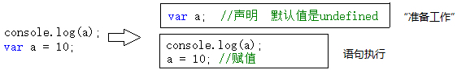

# 执行上下文

```
// Uncaught ReferenceError : a is not defind
console.log(a)

// undefined
console.log(a)
var a;

// undefined
console.log(a)
var a = 10
```

第一句报错，a 未定义，很正常。第二句、第三句输出都是 undefined，说明浏览器在执行 console.log(a)时，已经知道了 a 是 undefined，但却不知道 a 是 10（第三句中）。

在一段 js 代码拿过来真正一句一句运行之前，浏览器已经做了一些“准备工作”，其中就包括对变量的声明，而不是赋值。变量赋值是在赋值语句执行的时候进行的。可用下图模拟：



```
// window
console.log(this)
```

与第一种情况不同的是：第一种情况只是对变量进行声明（并没有赋值），而此种情况直接给 this 赋值。这也是“准备工作”情况要做的事情之一。

在第三种情况中，需要注意代码注释中的两个名词——“函数表达式”和“函数声明”。虽然两者都很常用，但是这两者在“准备工作”时，却是两种待遇。

```
// function f1(){}
console.log(f1)
function f1(){}

// undefined
console.log(f2)
var f2 = function(){}
```

在“准备工作”中，对待函数表达式就像对待“ var a = 10 ”这样的变量一样，只是声明。而对待函数声明时，却把函数整个赋值了。

在“准备工作”中完成了哪些工作：

-   变量、函数表达式——变量声明，默认赋值为 undefined；
-   this——赋值；
-   函数声明——赋值；

这三种数据的准备情况我们称之为“执行上下文”或者“执行上下文环境”。

## 函数

如果在函数中，除了以上数据之外，还会有其他数据。

```
function fn(x){
    console.log(arguments);
    console.log(x)
}
fn(10);
```

以上代码展示了在函数体的语句执行之前，arguments 变量和函数的参数都已经被赋值。从这里可以看出，函数每被调用一次，都会产生一个新的执行上下文环境。因为不同的调用可能就会有不同的参数。

**另外一点不同在于，函数在定义的时候（不是调用的时候），就已经确定了函数体内部自由变量的作用域**。

# call stack

执行全局代码时，会产生一个执行上下文环境，每次调用函数都又会产生执行上下文环境。当函数调用完成时，这个上下文环境以及其中的数据都会被消除，再重新回到全局上下文环境。处于活动状态的执行上下文环境只有一个。

其实这是一个压栈出栈的过程——执行上下文栈。如下图：


有一种情况，而且是很常用的一种情况，无法做到这样干净利落的说销毁就销毁。这种情况就是闭包。
