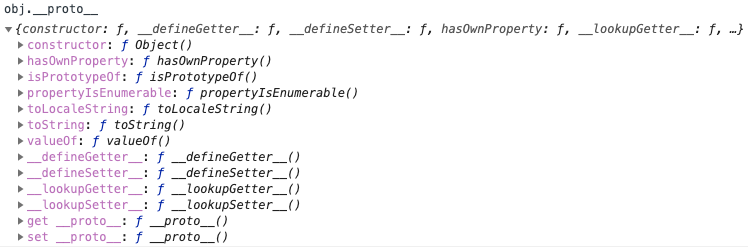
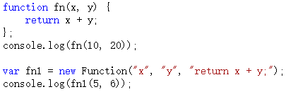
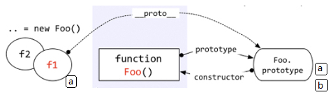
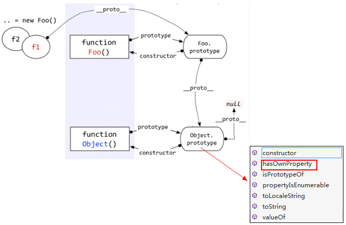

# 一切都是对象

“一切都是对象”这句话的重点在于如何去理解“对象”这个概念。当然，也不是所有的都是对象，值类型就不是对象。

typeof 操作符输出的类型

```
typeof undefined; // undefined
typeof 10; // number
typeof "abc"; // string
typeof true; // boolean

typeof function() {}); //function
typeof [1, "a", true]); //object
typeof { a: 10, b: 20 }); //object
typeof null; //object
typeof new Number(10)); //object
```

上面的四种（undefined, number, string, boolean）属于简单的值类型，不是对象。剩下的几种情况——函数、数组、对象、null、new Number(10)都是对象, 它们都是引用类型。

**判断一个变量是不是对象非常简单。值类型的类型判断用 typeof，引用类型的类型判断用 instanceof。**

## 对象——若干属性的集合。

java 或者 C#中的对象都是 new 一个 class 出来的，而且里面有字段、属性、方法，规定的非常严格。但是 javascript 就比较随意了——数组是对象，函数是对象，对象还是对象。对象里面的一切都是属性，只有属性，没有方法。那么这样方法如何表示呢？——方法也是一种属性。因为它的属性表示为键值对的形式。

而且，更加好玩的事，javascript 中的对象可以任意的扩展属性，没有 class 的约束。

以函数为例子：

```
const fn = function() {};
fn.a = 1;
fn.b = function() {};
fn.c = {
name: "wang"
};
```

上段代码中，函数就作为对象被赋值了 a、b、c 三个属性——很明显，这就是属性的集合。

在 typeof 的输出类型中，function 和 object 都是对象，为何却要输出两种答案呢？都叫做 object 不行吗？——当然不行。

# 函数和对象的关系

上文已经提到，函数就是对象的一种，因为通过 instanceof 函数可以判断。

函数是一种对象，但是函数却不像数组一样——你可以说数组是对象的一种，因为数组就像是对象的一个子集一样。

但是函数与对象之间，却不仅仅是一种包含和被包含的关系，函数和对象之间的关系比较复杂，甚至有一点**鸡生蛋蛋生鸡**的逻辑。

```
function Fn() {
 this.name = 'js';
 this.year = 2021;
 }
var fn1 = new Fn();
```

上面的这个例子很简单，它能说明：对象可以通过函数来创建。对！也只能说明这一点。

但是要说—对象都是通过函数创建的——有些人可能反驳：不对！因为：

```
var obj = { a: 10, b: 20 };
var arr = [5, 'x', true];
```

但是这个是一种“快捷方式”，在编程语言中，一般叫做“语法糖”。

其实以上代码的本质是：

```
//var obj = { a: 10, b: 20 };
//var arr = [5, 'x', true];

var obj = new Object();
obj.a = 10;
obj.b = 20;

var arr = new Array();
arr[0] = 5;
arr[1] = "x";
arr[2] = true;
```

而其中的 Object 和 Array 都是函数：

```
console.log(typeof (Object)); // function
console.log(typeof (Array)); // function
```

所以可以很负责任的说——对象都是通过函数来创建的。
现在是不是糊涂了—— 对象是函数创建的，而函数却又是一种对象——函数和对象到底是什么关系啊？

# prototype 原型

每个函数都有一个属性叫做 prototype(使用函数声明定义)。

这个 prototype 的属性值是一个对象（属性的集合，再次强调！），默认的只有一个叫做 constructor 的属性，指向这个函数本身。


如上图 SuperType 是是一个函数，右侧的方框就是它的原型。

原型既然作为对象，属性的集合，不可能就只弄个 constructor 来玩玩，肯定可以自定义的增加许多属性。例如这位 Object 大哥，人家的 prototype 里面，就有好几个其他属性。


也可以在自己自定义的方法的 prototype 中新增自己的属性

```
function Fn() { }
Fn.prototype.name = 'js';
Fn.prototype.getYear = function () {
 return 2021;
};

const fn = new Fn();
```

Fn 是一个函数，fn 对象是从 Fn 函数 new 出来的，这样 fn 对象就可以调用 Fn.prototype 中的属性。

因为每个对象都有一个隐藏的属性—\_\_proto\_\_，这个属性引用了创建这个对象的函数的 prototype。即：fn.\_\_proto\_\_ === Fn.prototype
这里的"\_\_proto\_\_"成为“隐式原型”.

# 隐式原型

每个对象都有一个\_\_proto\_\_属性，指向创建该对象的函数的 prototype。

\_\_proto\_\_是一个隐藏的属性，javascript 不希望开发者用到这个属性值，有的低版本浏览器甚至不支持。

```
var obj = {};
console.log(obj.__proto__)
```



上面截图看来，obj.\_\_proto\_\_和 Object.prototype 的属性一样.obj 这个对象本质上是被 Object 函数创建的，因此 obj.\_\_proto\_\_=== Object.prototype。

“Object prototype”也是一个对象，它的\_\_proto\_\_指向哪里？  
在说明“Object.prototype”之前，先说一下自定义函数的 prototype。自定义函数的 prototype 本质上就是和 var obj = {} 是一样的，都是被 Object 创建，所以它的\_\_proto\_\_指向的就是 Object.prototype。
但是 Object.prototype 是一个特例——它的\_\_proto\_\_指向的是 null，切记切记！

还有函数也是一种对象，函数也有\_\_proto\_\_吗？  
函数也不是从石头缝里蹦出来的，函数也是被创建出来的。谁创建了函数呢？——Function



以上代码中，第一种方式是比较传统的函数创建方式，第二种是用 new Functoin 创建。
首先根本不推荐用第二种方式, 这里只是向大家演示，函数是被 Function 创建的, 因此 Object.\_\_proto\_\_ === Function.prototype


上图中很明显的标出了：自定义函数 Foo.\_\_proto\_\_指向 Function.prototype，Object.\_\_proto\_\_指向 Function.prototype.怎么还有一个 Function.\_\_proto\_\_指向 Function.prototype？这不成了循环引用了？  
对！是一个环形结构。Function 也是一个函数，函数是一种对象，也有\_\_proto\_\_属性。既然是函数，那么它一定是被 Function 创建。所以——Function 是被自身创建的。所以它的\_\_proto\_\_指向了自身的 Prototype。

Function.prototype 指向的对象，它的\_\_proto\_\_是不是也指向 Object.prototype？  
答案是肯定的。因为 Function.prototype 指向的对象也是一个普通的被 Object 创建的对象，所以也遵循基本的规则。

# 原型链与继承

javascript 中的继承是通过原型链来体现的。

```
function Foo() {}

const f1 = new Foo();
f1.a = 1;

Foo.prototype.a = 100;
Foo.prototype.b = 200;

console.log(f1.a);
console.log(f1.b);
```

以上代码中，f1 是 Foo 函数 new 出来的对象，f1.a 是 f1 对象的基本属性，f1.b 是怎么来的呢？——从 Foo.prototype 得来，因为 f1.\_\_proto\_\_指向的是 Foo.prototype

**访问一个对象的属性时，先在基本属性中查找，如果没有，再沿着\_\_proto\_\_这条链向上找，这就是原型链**。


上图中，访问 f1.b 时，f1 的基本属性中没有 b，于是沿着\_\_proto\_\_找到了 Foo.prototype.b。

## hasOwnProperty

在实际应用中区分一个属性到底是基本的还是从原型中找到的，特别是在 for…in…循环中，一定要注意。  
它是从 Object.prototype 中来的：



对象的原型链是沿着\_\_proto\_\_这条线走的，因此在查找 f1.hasOwnProperty 属性时，就会顺着原型链一直查找到 Object.prototype。

**由于所有的对象的原型链都会找到 Object.prototype，因此所有的对象都会有 Object.prototype 的方法。这就是所谓的“继承”**。
