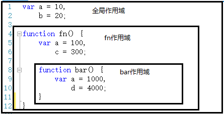

# 作用域



全局代码和 fn、bar 两个函数都会形成一个作用域。而且，作用域有上下级的关系，上下级关系的确定就看函数是在哪个作用域下创建的。例如，fn 作用域下创建了 bar 函数，那么“fn 作用域”就是“bar 作用域”的上级。  
作用域最大的用处就是隔离变量，不同作用域下同名变量不会有冲突。例如以上代码中，三个作用域下都声明了“a”这个变量，但是他们不会有冲突。各自的作用域下，用各自的“a”。

# 作用域链

## 什么是自由变量

首先认识一下什么叫做 自由变量 。如下代码中，console.log(a)要得到 a 变量，但是在当前的作用域中没有定义 a（可对比一下 b）。当前作用域没有定义的变量，这成为 自由变量 。自由变量的值如何得到 —— 向上级作用域寻找

```
var a = 100
function fn() {
var b = 200
console.log(a) // 这里的 a 在这里就是一个自由变量
console.log(b)
}

fn()
```

## 什么是作用域链

如果上级也没呢？再一层一层向上寻找，直到找到全局作用域还是没找到，就宣布放弃。这种一层一层的关系，就是 作用域链 。

**执行上下文在运行时确定，随时可能改变；作用域在定义时就确定，并且不会改变**。
