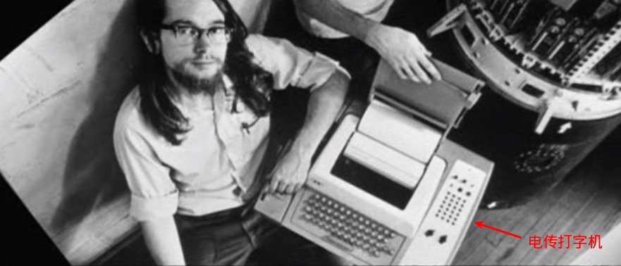

一台大型主机往往需要支持许多用户同时使用，每个用户所使用操作的设备，就叫做终端.

终端使用通信电缆与电脑主机连接，甚至可以通过电信网络（电话、电报线路等等）连接另一个城市的电脑。
 	
终端是一台物理设备，只用于输入输出，本身没有强大的计算能力。在计算资源紧张的时代，人们想共享一台计算机，可以通过终端连接到计算机上，将指令输入终端，终端传送给计算机，计算机完成指令后，将输出传送给终端，终端将结果显示给用户。
 
电传打字机 tty

个人计算机是上世纪70年代末开始出现的。在那之前，人们只能在公司或大学里使用大型机(mainframe)和小型机(minicomputer)。这些计算机非常昂贵，Unix创始人肯•汤普逊和丹尼斯•里奇使用的PDP-7小型机当年的价格为72000美元，GE-45大型机价格高达1000万美元。

肯•汤普逊和丹尼斯•里奇想让Unix成为一个多用户系统。多用户系统意味着要给每个用户配置一个终端，每个用户都要有一个显示器、一个键盘。但当时所有的计算机设备(包括显示器)价格都非常昂贵，而且键盘和主机是集成在一起的，根本没有独立的键盘。

最后他们找到了一样东西，那就是ASR33电传打字机。ASR是英文Automatic Send-Receive的首字母缩写。虽然电传打字机的用途是在电报线路上收发电报，但是它也可以作为人与计算机的接口，而且价格低廉。ASR33打字机的键盘用来输入信息，打印纸用来输出信息。

所以他们把ASR33电传打字机作为终端，很多个ASR33连接到同一个主机，每个用户都可以在终端输入用户名和密码登录主机。这样他们创造了计算机历史上的第一个真正的多用户系统Unix，而ASR33成为第一个Unix终端。

TTY是电传打字机Teletypewriter的缩写，在带显示屏的视频终端出现之前，TTY是最流行的终端设备。它是早期的终端（物理设备），它们用于向计算机发送数据，并将计算机的返回结果打印出来。显示器出现后，终端不再将结果打印出来，而是显示在显示器上，但是tty的名字还是保留了下来。

控制台 console

在早期的电脑上往往具有带有大量开关和指示灯的面板，可以对电脑进行一些底层的操作，这个面板就叫做Console。其概念来自于管风琴的控制台。
 
控制台(Console)是物理设备，用于输入输出，它直接连接在计算机上，是计算机系统的一部分。计算机输出的信息会显示在控制台上。一台电脑只能有一个Console，很多时候是电脑主机的一部分，和CPU共享一个机柜。

Console是用来管理主机的，只能给系统管理员使用。Console与一般终端在外表上没什么区别，但在功能上却大不相同，有些事情只能在console完成，而不能在终端完成。例如，当系统启动出现错误时，错误信息会显示在Console的显示器屏幕上，而不会显示在一般的终端上。这是因为系统还没有成功启动，用户是不能在一般的终端登录系统的。另外，当主机需要维护或修复问题时，Unix以单用户模式启动(single-user mode)。在单用户模式下，只有console才能连接到主机，其他终端没有权限访问主机。

个人计算机上的显示器和键盘既可以认为是Console，也可以是一般的终端。当你在管理系统时，它们是Console；当你在做一般的工作时(浏览网页、编辑office文档等)，它们是终端。

现在，人们把console和Terminal看成是同义词，在使用时往往不区分它们原来的差别。这是因为在90年代中期以前，人们都是在公司或大学里通过终端访问Unix，有专门的系统管理员在console管理系统。而现在，人们可以拥有自己的Unix，在自己的电脑上使用Unix，这时候，console和终端是一体的，自己既是一般用户，也是系统管理员。

虚拟控制台

 虚拟控制台(Virtual Console)和虚拟终端是一样的。我们只有一台终端（物理设备），这是我们与计算机之间的用户接口。假如有一天，我们想拥有多个用户接口，那么，一方面我们可以增加终端数目（物理设备），另一方面，还可以在同一台终端（物理设备）上虚拟出多个终端，它们之间互相不影响，至少看起来互相不影响， 这些终端就是虚拟终端。

 Unix允许用户在自己电脑上使用多个终端，其中有一个是图形终端，其他六个是字符终端。这七个终端使用同一个显示器和键盘。如果我们需要从一个终端切换到另外一个终端，只需按一下快捷键。一般情况下当我们启动Linux系统时，图形界面自动启动。但有一件事你可能不知道，实际上Linux会同时启动七个不同的终端模拟程序，这七个特殊的终端模拟程序叫做虚拟控制台。

 虚拟终端附加在物理终端之上的，是以软件方式虚拟实现的终端。系统开机后会启动6个虚拟终端，在CentOs6系统，默认使用tty1登录，可以使用快捷键 Ctrl+Alt+F[1-6]切换虚拟终端。在CentOs7系统，如果进入系统默认启动图形终端时，则tty1被图形终端占用。

尽管虚拟控制台只是文本模式的控制台终端，但你可以修改文字和背景色。比如可将终端的背景色设置成白色、文本设置成黑色，这样可让眼睛轻松些。

终端模拟程序

终端模拟程序就是我们平常在Linux桌面环境中打开的终端窗口(Terminal Window)，它是个虚拟终端，但主机会认为它就是真正的终端。终端模拟程序也可以叫做终端模拟器(Terminal Emulator)。

如果你使用Unity或Gnome桌面，那么在终端里输入命令man gnome-terminal，在gnome-terminal的手册里你会看到对gnome-terminal的介绍。gnome-terminal是 一个终端模拟程序，它模拟的是xterm。

xterm也是一个终端模拟程序，xterm模拟的是DEC公司制造的VT102终端。

终端模拟程序可以模拟任何终端，包括真实终端和虚拟终端。但实际上只有四种终端被作为模拟的对象: DEC公司1978年制造的VT100终端和xterm终端模拟程序是最常见的两个模拟对象。另外两个不太常见的模拟对象是DEC公司生产的VT220终端和用于IBM大型机的3270终端。

伪终端

 伪终端（Pseudo Terminal）是成对的逻辑终端设备, 它们与实际物理设备并不直接相关。如果一个程序把ttyp3看作是一个串行端口设备，则它对该端口的读/写操作会反映在该逻辑终端设备对的另一个上面（ptyp3）。而ptyp3则是另一个程序用于读写操作的逻辑设备。这样，两个程序就可以通过这种逻辑设备进行互相交流，而其中一个使用ttyp3的程序则认为自己正在与一个串行端口进行通信,这很像是逻辑设备对之间的管道操作。 

 如果某人在网上使用telnet程序连接到你的计算机上，则telnet程序就可能会开始连接到设备ptyp2（m2）上（一个伪终端端口上）。此时一个getty程序就应该运行在对应的ttyp2（s2）端口上。当telnet从远端获取了一个字符时，该字符就会通过m2、s2传递给getty程序，而getty程序就会通过s2、m2和telnet程序往网络上返回”login:”字符串信息。这样，登录程序与telnet程序就通过“伪终端”进行通信.

远程登录就是通过伪终端实现的. 